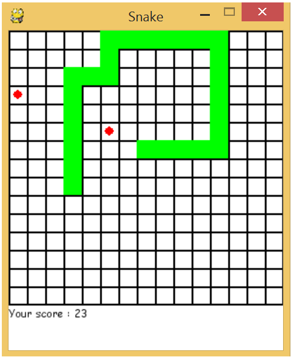

# Snake

A simple implementation of the famous game Snake with Python module Pygame.

You can play the game with Python by running the file Snake.py. Otherwise, you can use the executable on the Snake folder : Snake.exe.

## Game demonstration

You can see here an example of the game after a few moves.

